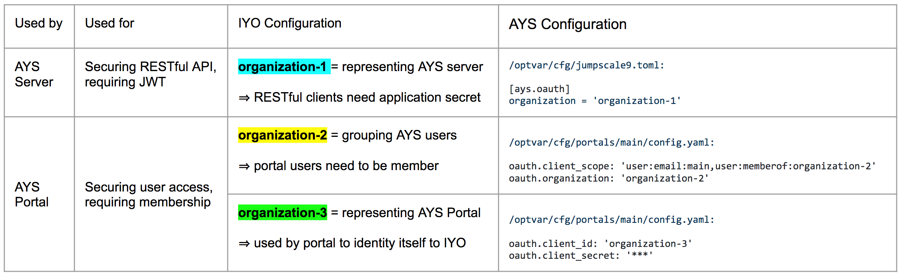

# Installation of an AYS Portal

In order to install an AYS Portal you need a JumpScale environment with the JumpScale Portal Framework installed, so AYS Portal is actually a JumpScale portal app, just as for instance the Cloud Broker Portal that come with OpenvCloud.

The JumpScale portal framework is installed as part of a JS9 Docker container when using the `-p` option during the build step, as documented in the [jumpscale/developer](https://github.com/Jumpscale/developer/blob/master/README.md)) repository.

In case you didn't install the JumpScale portal framework, you can use the following commands in the interactive shell in order to still add it to your environment:
```python
prefab = j.tools.prefab.local
prefab.apps.portal.install()
```

Once the portal framework is installed on your JumpScale environment, you can add the AYS Portal by executing the following commands in the interactive shell:
```python
prefab = j.tools.prefab.local
prefab.apps.atyourservice.install()
```

In case you didn't yet install the portal framework, or simply want to reinstall the portal framework as part the AYS Portal installation, you can use the option `install_portal` as follows:
```python
prefab = j.tools.prefab.local
prefab.apps.atyourservice.install(install_portal=True)
```

This will start the AYS Portal in a new TMUX window.

The AYS Portal is configured in `/optvar/cfg/portals/main/config.yaml`, which is the configuration that common to all portal apps using the JumpScale portal framework in your JumpScale environment.

Here's the default configuration:
```yaml
mongoengine.connection:
    host: 'localhost'
    port: 27017

rootpasswd: 'admin'

ipaddr: '127.0.0.1'
port: '8200'
appdir: '$JSAPPSDIR/portals/portalbase'
filesroot: '$VARDIR/portal/files'
defaultspace: 'system'
admingroups:
    - 'admin'
authentication.method: 'me'
gitlab.connection: 'main'
force_oauth_instance: ''  # set to use oauth
contentdirs: ''

production: False

oauth.client_url: 'https://itsyou.online/v1/oauth/authorize'
oauth.token_url: 'https://itsyou.online/v1/oauth/access_token'
oauth.redirect_url: 'http://ae5d255c.ngrok.io/restmachine/system/oauth/authorize'
oauth.client_scope: 'user:email:main,user:memberof:JSPortal'
oauth.organization: 'testOrg'
oauth.client_id:  'JSPortal'
oauth.client_secret:  '8plUHNtpaQp8NExkRa-3MYa1SWkOr1mgEqRxGBm25DD78tHXiIlS'
oauth.client_user_info_url:  'https://itsyou.online/api/users/'
oauth.client_logout_url:  ''

oauth.default_groups:
    - admin
    - user
```

In order to activate ItsYou.online integration, you'll need to update following items:
```yaml
force_oauth_instance: 'itsyouonline'
production: true

oauth.redirect_url: 'http://172.25.226.34:8200/restmachine/system/oauth/authorize'

oauth.client_scope: 'user:email:main,user:memberof:organization-2'
oauth.organization: 'organization-2'

oauth.client_id: 'organization-3'
oauth.client_secret:  '****'
```

- `force_oauth_instance` and `production` both need to be set as above in order to activate the ItsYou.online authorization
- `oauth.redirect_url` specifies the callback URL that will be passed to ItsYou.online, update it with the URL where your AYS Portal is available
- `oauth.client_scope` and `oauth.organization` both include the name of the ItsYou.online organization (here `organization-2`) to which you as an AYS Portal user need to be member; this can be the same organization as specified for `client_id`
- `oauth.client_id` specifies the name of the ItsYou.online organization (here `organization-3`) as which the AYS Portal identifies itself to ItsYou.online; as an AYS Portal user you are not necessairly owner or member of this organization, but it is supported to specify the same organization as specified in ``oauth.organization``
- `oauth.client_secret` is a client secret for the organization specified in `oauth.client_id`


While you can specify the same organization for both `oauth.organization` and `oauth.client_id`, which can even be the same organization as specified in the [AYS Server Configuration](../../gettingstarted/ays-server-configuration.md), it is supported to use 3 distinct ItsYou.online organizations. The below table clarifies how the three organizations are used.



After having updated the configuration, you'll need to restart the portal. This is typically achieved by using CTRL+C in the TMUX window where the portal is running, and re-executing the last command.
