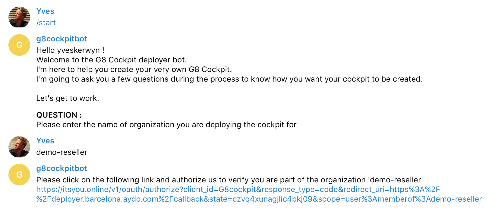
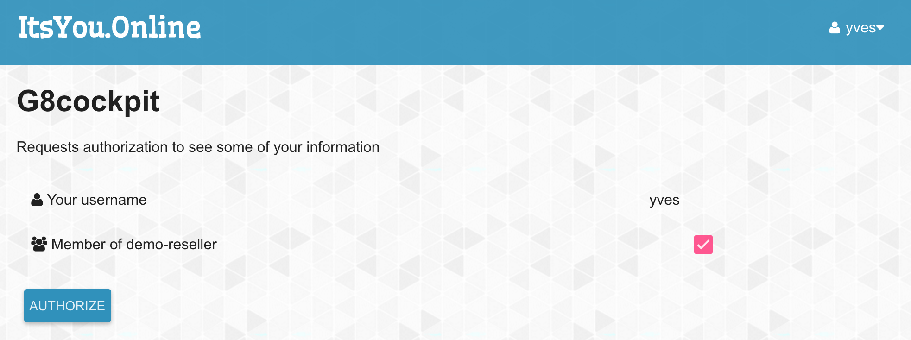
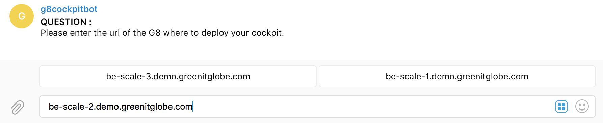
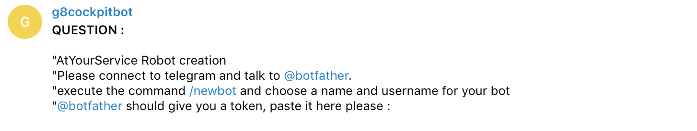
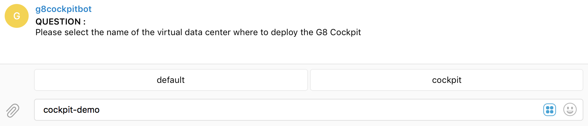
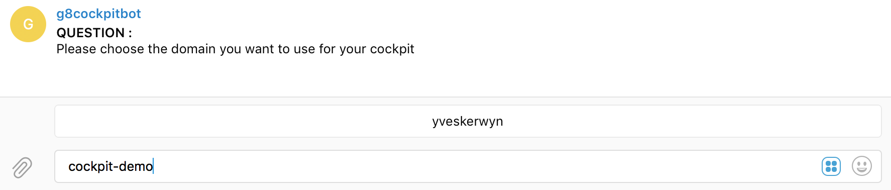
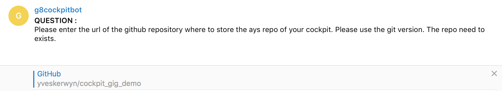
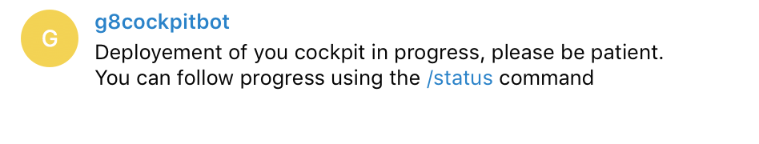

## Installation using the Cockpit Deployer Chatbot

> The recommended way to deploy a Cockpit is using the **Cockpit Deployer Chatbot**, as an alternative to installing using an AYS blueprint.

Before continuing make sure you have done all preparation work as documented in the [Prepararion](../prep/prep.md) section.

An instance of the **Cockpit Deployer Chatbot** is active as **@cockpit81_bot** on Telegram. You can also install your own instance of this **Cockpit Deployer Chatbot** by following the [Cockpit Deployer Chatbot installation instructions](installation-of-the-deployer-chatbot.md).

Talk to **@cockpit81_bot** on Telegram.

The chatbot will ask you some questions about the **Cockpit** you want to deploy. After answering the questions, the chatbot will take care of deploying a new **Cockpit** on a G8.

At the end of the deployment the chatbot will send you the information to access/use your newly created Cockpit.

Details about the questions:

- **Organization**: a Cockpit is always deployed for an organization, which needs to exists on https://itsyou.online/
  - See [ItsYou.online pre-installation preparation](../prep/Itsyou.online/Itsyou-online.md) section for more information about this

- **URL of the G8**: the chatbot will propose you multiple G8s where you can deploy your Cockpit, make sure to choose one where you have a username with access to a (cloud) account

- **Login**: your username on the selected G8

- **Password**: the password of your username on the selected G8

- **VDC Name**: the name of the VDC on the selected G8 where you want to deploy your Cockpit, if the VDC doesn't exist yet, it will be created
  - See the section [Creating a Cloud Space](../prep/CloudSpace/CloudSpace.md) for more information about this
  - Only use lowercases, since all capital letters will be ignored/converted to lowercases

- **VDC Location**: The location on which the vdc would be created

- **Domain**: the subdomain name you want for your Cockpit, this can be anything as long as it's a valid/unique subdomain name that will be created as subdomain of `aydo2.com`

- **URL of the GitHub Repository**: a Cockpit can save (on-demand) all AYS service instance information into your GitHub repository
  - See the [GitHub pre-installation preparation](../prep/GitHub/GitHub.md) section for more information about this

Once your Cockpit is installed, you will get following information about your Cockpit:

- URL to reach the portal
- IP address and SSH command to connect to the virtual machine running your Cockpit
- SSH key to access the virtual machine

Below some screenshots of the installation conversation in Telegram:

