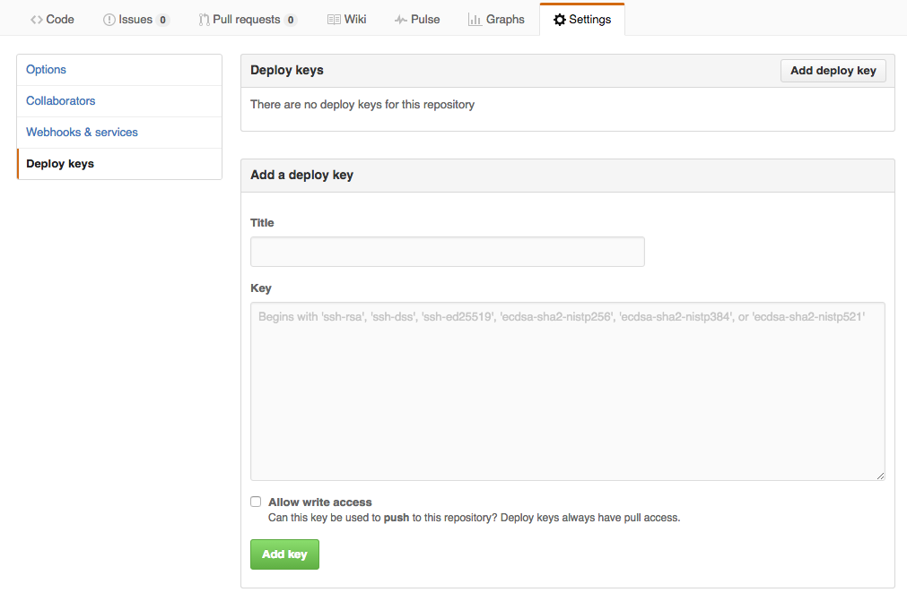

## Installation of a Cockpit

## Development Cockpit:
 [Installing a development cockpit](Using-Cuisine/using-cuisine.md)

## Production Cockpit:

There are two ways to install a new production cockpit:

- [Installing using Telegram](Using-Telegram/using-Telegram.md) (highly recommended)
- [Installing using an AYS Blueprint](Using-Blueprint/using-blueprint.md)

Both options requires some pre-installation preparation, documented [here](prep/prep.md).

### Allow the Cockpit to push to your Github repository

The last thing you need to do is enabling your **Cockpit** to save all AYS service instance information into your GitHub repository.

This is achieved by adding the deploy key generated by the **Cockpit** to the deploy keys of your GitHub repository:

- Go to the **Settings** page of the GitHub repository specified during installation
- Click **Add deploy key** in the **Deploy keys** tab
- Copy the content of the public key that you can find in the **Information** page of your **Cockpit Portal**:

- Select **Allow write access** and click the **Add key** button
