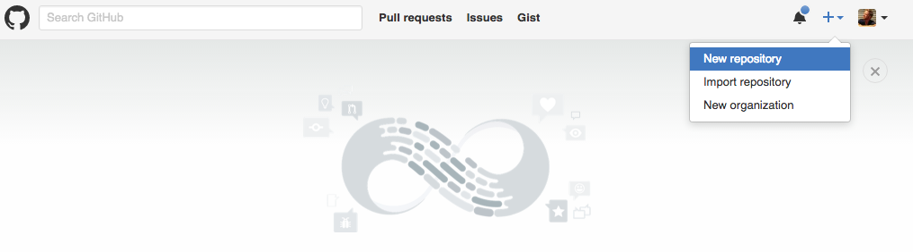
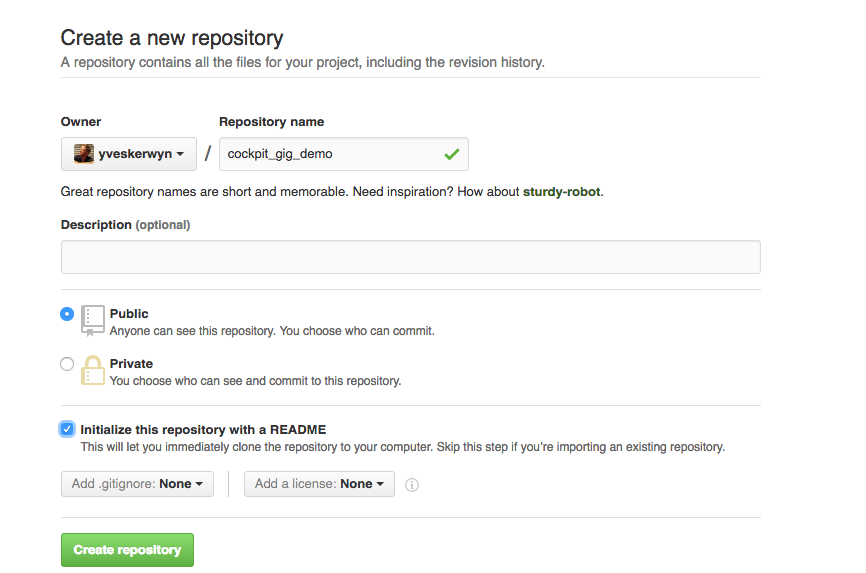
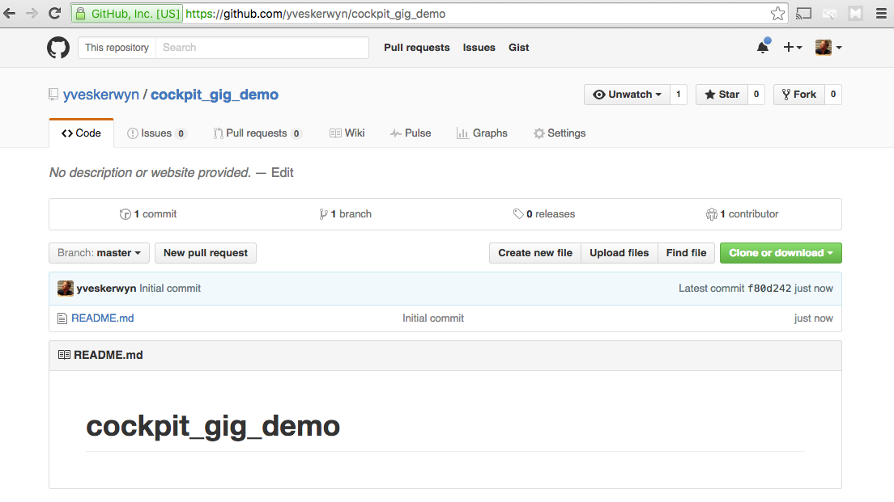

## Create a GitHub Repository

The **Cockpit** will push all AYS service instance information into a **GitHub** repository that you need to create yourself.

This is quite straight forward:

- Go to GitHub.com and click **New repository** from the drop-down menu that appears when clicking the **+** sign:

  

- Specify a repository name and click the **Create repository** button

  

- Your repository is ready:

  

You will need the address of your repository when installing your Cockpit, this is simply the URL in the address bar of your browser, in this example: `https://github.com/gig-projects/cockpit_gig_moehaha-demo`.

It is recommended to connect to GitHub over SSH, instead of HTTP, so you rather use the SSH url, which is in this case: `git@github.com:gig-projects/cockpit_gig_moehaha-demo.git`
