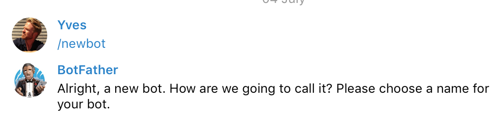
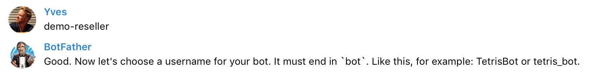
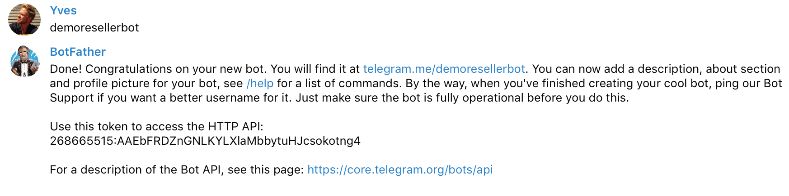
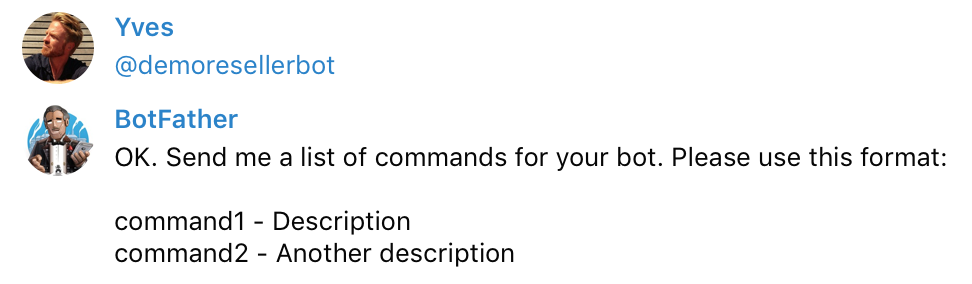
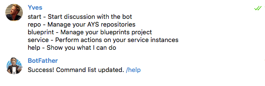

## Create a Telegram Chatbot

As part of the **Cockpit** installation you'll be asked to specify an **API token from Telegram**.

This is the token that the **Cockpit Chatbot** module uses to communicate with the Telegram servers for controlling the chatbot conversations.

In order to get this API token, you need to create the create a new chatbot, this is done by talking with the `@botfather` on Telegram:

- Connect to Telegram and talk to `@botfather`
- Execute the command `/newbot`:

  

- Choose a name for your chatbot:

  

- Choose a username for your chatbot, ending with `bot`:

  

As a result you get the API token needed during the actual installation.

You also will want to add command descriptions for your chatbot.

- Do this by using the `/setcommands` command:

  

- Select the bot for which you want to set the commands:

  

- Paste following lines:

  ```
  start - Start discussion with the bot
  repo - Manage your AYS repositories
  blueprint - Manage your blueprints project
  service - Perform actions on your service instances
  help - Show you what I can do
  ```

- You'll see following result:

  
