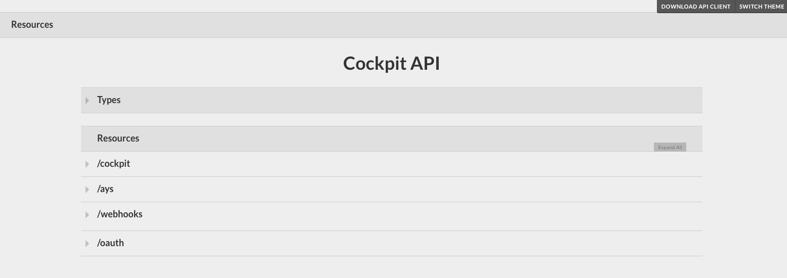
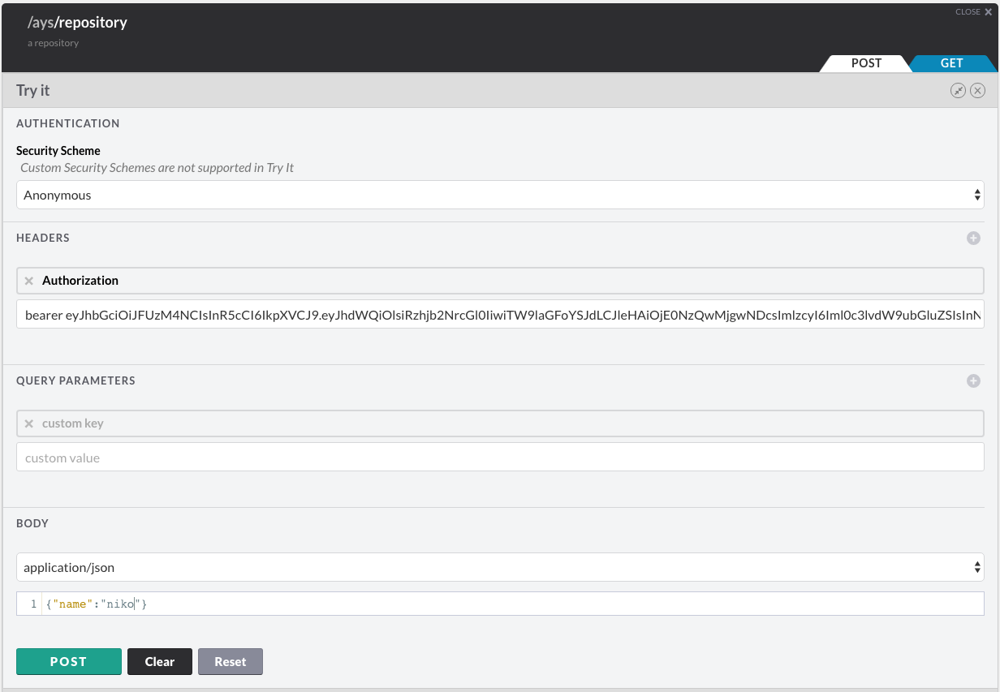
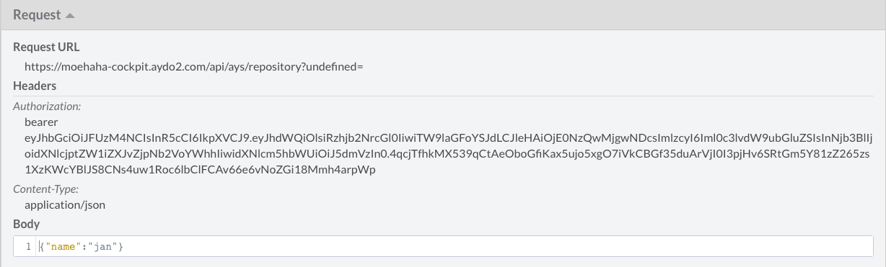
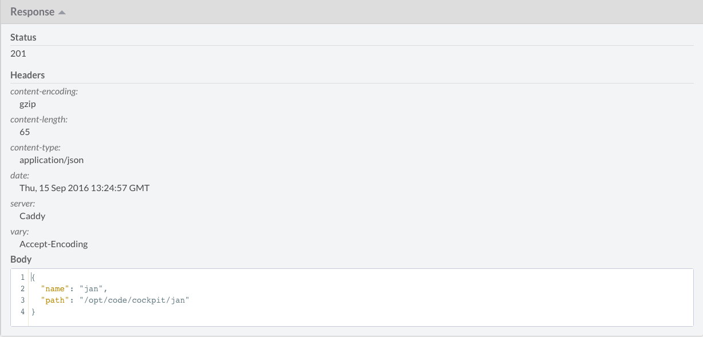

## Using the API Console

The **Cockpit Portal** also exposes the REST API through the [API Console](https://github.com/mulesoft/api-console/).

You can access the **API Console** by clicking the **API** link in the left navigation menu:

In order to call the API, you always need a JWT token. See the sections [Generating JWT tokens](../JWT/JWT.md) and [How to get a JWT](../Howto/Get_JWT/Get_JWT.md).

Once you have your JWT token, you can easily test the API through the **API Console**.

For instance for creating a new repository:

- Click the **POST** tab of **/ays/repository**
- Pass `bearer $JWT` as a value for **Authorization** in the header
- And specify {"name":"niko"} for the body

Click **POST**, and check the **Request** and **Response**:

