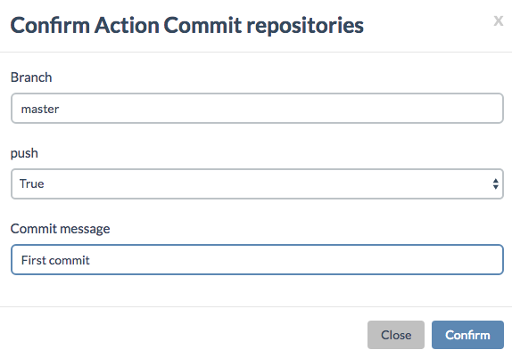

## Commit Repositories

You can have the Cockpit save all AYS service instance information into your GitHub repository.

This is achieved by selecting the **Commit repositories** from the Action menu on the **AYS Repositories** page:

This will only work if you've add the deploy key generated by the Cockpit to the deploy keys of your GitHub repository. See the instruction about this in the [installation documentation](../installation/installation).

