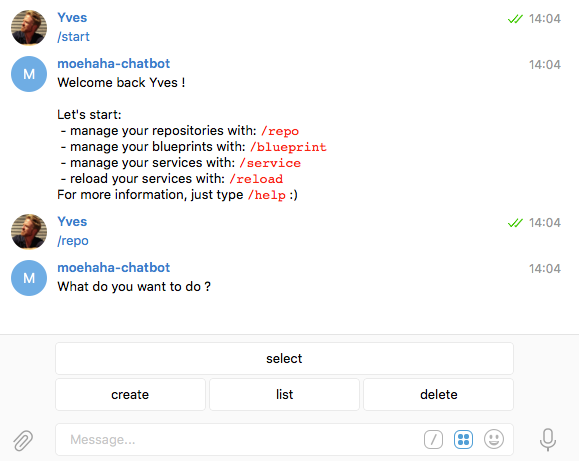
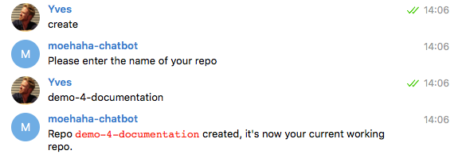

## How to create a new repository

You can create a repository in multiple ways:

- [Using the Telegram Chatbot](#telegram)
- [In the Cockpit Portal](#portal)
- [Using the Cockpit API](#api)
- [At the CLI](#cli)

<a id="telegram"></a>
### Using the Telegram Chatbot

Here using the @moehaha-chatbot:



After clicking **create** specify a name for the new repository, and see the result:




<a id="portal"></a>
### Using the Cockpit Portal

See the [Getting started with blueprints](../../Getting_started_with_blueprints/Getting_started_with_blueprints.md) section.


<a id="api"></a>
### Using the Cockpit API

In order to use the Cockpit API you first need to obtain an JWT, as documented in the section about [how to get a JWT](../Get_JWT/Get_JWT.md).

Once you got the JWT:

```
curl -H "Authorization: bearer JWT"  /
     -H "Content-Type: application/json" /
     -d '{"name":"test-repo"}'
     https://BASE_URL/api/ays/repository
```

In the **API Console**:


For more information about the **API Console** go to the section about the [API Console](../../API_Console/API_Console.md).


<a id="cli"></a>
### At the CLI

To create a new repository execute the following command:

`ays repo create --git {git repo url} --name {path of reopsitory}`

The command will create a new repo in the path specified in the **name** option, and the **git** option is the url of the git repository that will be atached to this repo.

Viewing the possible options is possible using the **help** option:

```
ays repo create --help
Usage: ays repo create [OPTIONS]

  create a new AYS repository

Options:
  -n, --name TEXT  name of the new AYS repo you want to create
  -g, --git TEXT   URL of the git repository to attach to this AYS repository
  --help           Show this message and exit.
```
