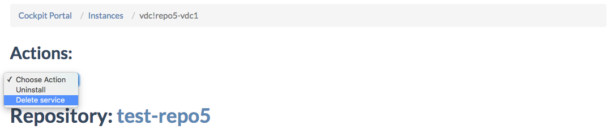
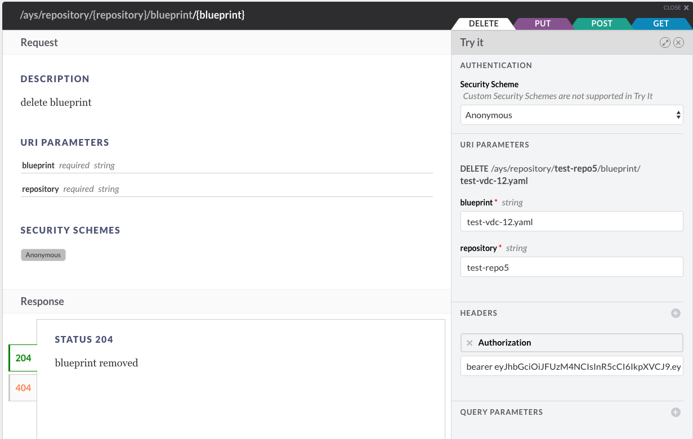

## How to delete a blueprint

You can delete a blueprint in multiple ways:

- [Using the Telegram Chatbot](#telegram)
- [In the Cockpit Portal](#portal)
- [Using the Cockpit API](#api)
- [At the CLI](#cli)

All are discussed here below.


<a id="telegram"></a>
### Using the Telegram Chatbot

@todo


<a id="portal"></a>
### Using the Cockpit Portal

Go to the **Instance Details** page of the service instance, and select **Delete service** from the **Actions** dropdown:




<a id="api"></a>
### Using the Cockpit API

In order to use the Cockpit API you first need to obtain an JWT, as documented in the section about [how to get a JWT](../Get_JWT/Get_JWT.md).

Once you got the JWT, you can delete a blueprint, for instance here below for delete the blueprint with name "test-vdc-2.yaml":

```
curl -X DELETE
     -H "Authorization: bearer JWT"  /
     https://BASE_URL/api/ays/repository/{repository}/blueprint/{blueprint}
```

In the **API Console**:



For more information about the **API Console** go to the section about the [API Console](../../API_Console/API_Console.md).


<a id="cli"></a>
### At the CLI

@todo
