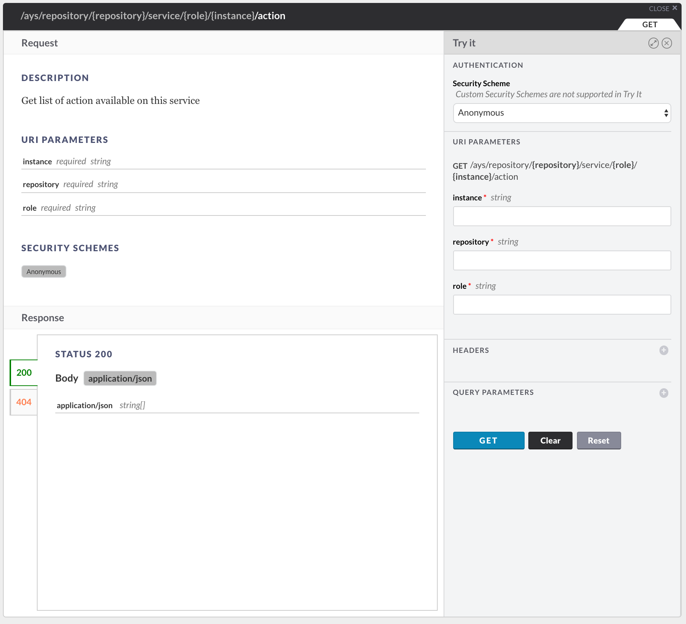
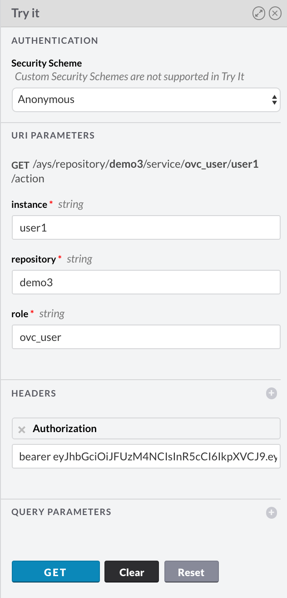
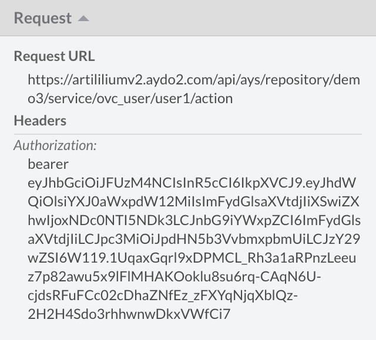

## List all available actions for a service instance

Two ways of listing all available actions for a service instance are documented here:
- [Using the curl](#curl)
- [Using the API Console](#api-console)

### Using curl

curl -X GET
     -H "Authorization: bearer JWT"  /
     -d "action=install&async=true&force=false"
     https://BASE_URL/api/ays/repository/REPOSITORY-NAME/service/SERVICE-ROLE/INSTANCE-NAME/action

### Using the API Console

There is a Cockpit API for that which you can easily test using the **API Console**:

You will first need to acquire an JWT.

Fill out the form:

When you click **GET** following request will be send:

And the response:

For information about the **API Console** go [here](../../API_Console/API_Console.md).
