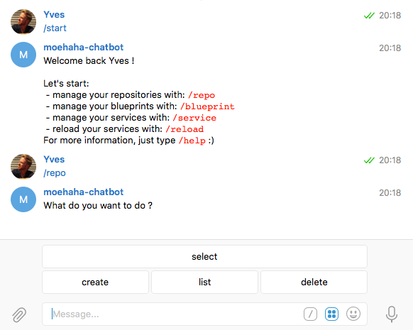
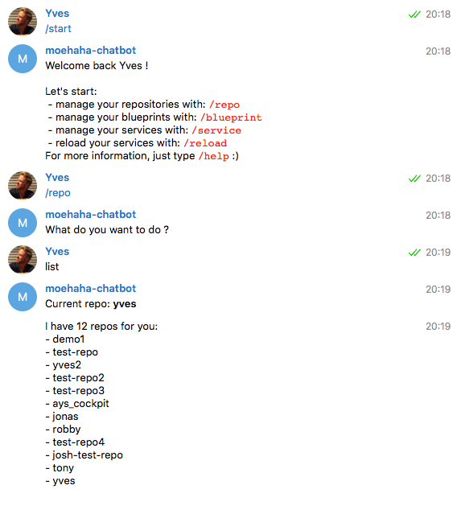

## How to list all Repositories

- [Using the Telegram Chatbot](#telegram)
- [In the Cockpit Portal](#portal)
- [Using the Cockpit API](#api)


<a id="telegram"></a>
### Using the Telegram Chatbot

Here's how to request the list:


Select list:



<a id="portal"></a>
### Using the Cockpit Portal

See the [Getting started with blueprints](../../Getting_started_with_blueprints/Getting_started_with_blueprints.md) section.


<a id="api"></a>
### Using the Cockpit API

In order to use the Cockpit API you first need to obtain an JWT, as documented in the section about [how to get a JWT](../Get_JWT/Get_JWT.md).

Once you got the JWT:

```
curl -X GET
     -H "Authorization: bearer JWT"  /
     https://BASE_URL/api/ays/repository
```

Also see the section about the [API Console](../../API_Console/API_Console.md)
