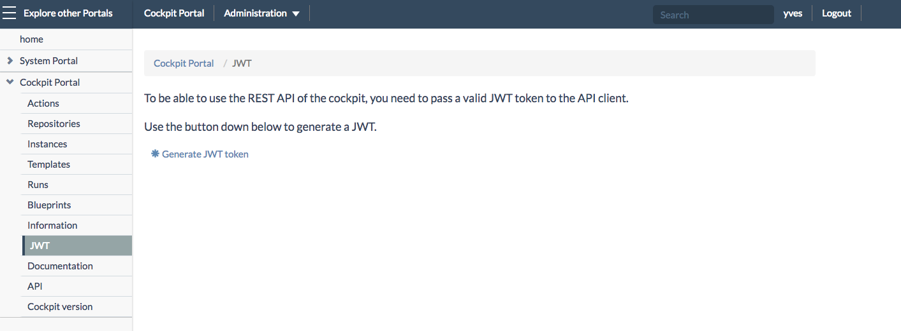
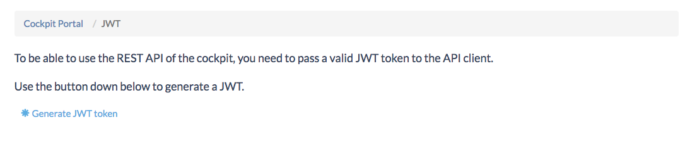
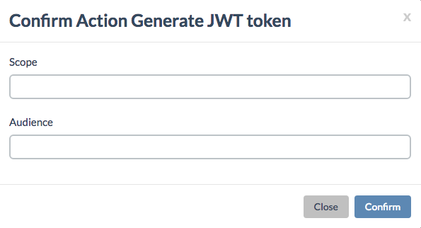
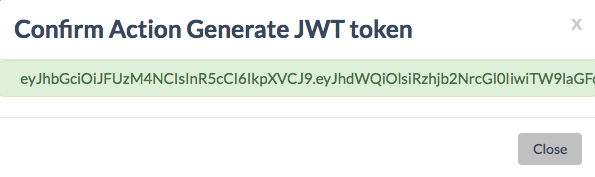

## Generating JWT Tokens

You can interact with the Cockpit on behalf of an organization, or on behalf of a user:

- In case of interacting on behalf of an organization, you need a JWT created for that organization
- In case of interacting on behalf of a user, you need a JWT created for that user

Depending on the case the Cockpit will check whether:
- the audience is set to the client ID of organization (`audience=<clientId-of-the-orgnization>`) for witch the Cockpit was setup
- the user is member of the organization (`scope=memberof:<clientId-of-the-orgnization>`) for witch the Cockpit was setup

You've two options to generate JWT tokens for the Cockpit:
- [Generate a JWT via the Cockpit Portal](#portal)
- [Generate a JWT directly by interacting with ItsYou.online](#itsyouonline)

### Generate a JWT via the Cockpit Portal

Clicking **JWT** in the left navigation menu of the **Cockpit Portal** brings you to a page where can quickly generate a JWT token:

The Cockpit Portal provides an easy way to generate such a JWT token:

- Go to the `/cockpit/jwt` page on the Cockpit Portal
- Click on **\*Generate JWT token**

The **Confirm Action Generate JWT token** window will popup:

Here you specify:
- **Scope**
- **Audience**

As a result you'll get the JWT token:

To copy the token double-click it (twice) in order to make sure you have fully selected the string.

You can quickly test the JWT token using the **API Console**, as documented [here](../API_Console/API_Console.md).

### Generate a JWT by interacting directly with ItsYou.online

This is what you will need in case of programmatically interacting with the Cockpit.

Two cases are discussed here:
- [Interacting on behalf of an organization](#organization)
- [Interacting on behalf of a user](#user)

#### On behalf of an organization
In case of interacting with the Cockpit on behalf of an organization:

- First get an OAuth access token for the organization using the **Client Credentials Flow**, e.g. in the below example for the organization with client_id = Moehaha:

`https://itsyou.online/v1/oauth/access_token?grant_type=client_credentials&client_id=Moehaha&client_secret=xyz`

- Then get a JWT to talk to the Cockpit on behalf of this organization, using the OAuth token in de header prefixed with "token" as a value if Authorization:

`Authorization token <OAuth token received from previous call> https://itsyou.online/v1/oauth/jwt?aud=moehaha`

#### On behalf of a user
In case of interacting with the Cockpit on behalf of a user, you can also use the **Client Credentials Flow**, but that is really a bad practice, you rather want to use the **Authorization Code Flow**, which requires one extra step:

- First redirect the user to ItsYou.online to approve that your code can access the user's ItsYou.online profile:

  `https://itsyou.online/v1/oauth/authorize?response_type=code&client_id=CLIENT_ID&redirect_uri=CALLBACK_URL&scope=user:name&state=STATE`

- Then request the actual OAuth access token:

  `POST https://itsyou.online/v1/oauth/access_token?client_id=CLIENT_ID&client_secret=CLIENT_SECRET&code=AUTHORIZATION_CODE&redirect_uri=CALLBACK_URL&state=STATE`

- Then get a JWT to talk to the Cockpit on behalf of this user, using the OAuth token in de header prefixed with "token" as a value if Authorization:

  `Authorization token <OAuth token received from previous call> https://itsyou.online/v1/oauth/jwt?user:ismemberof:moehaha`

Also see [How to get a JWT](../Howto/Get_JWT/Get_JWT.md).
