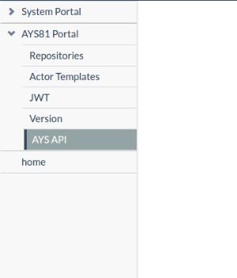
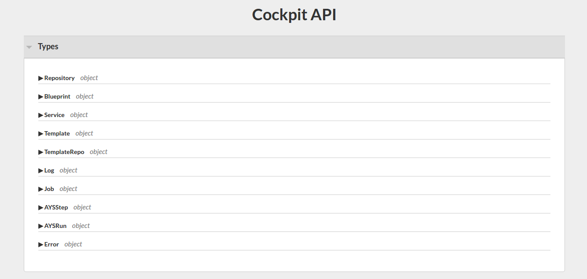
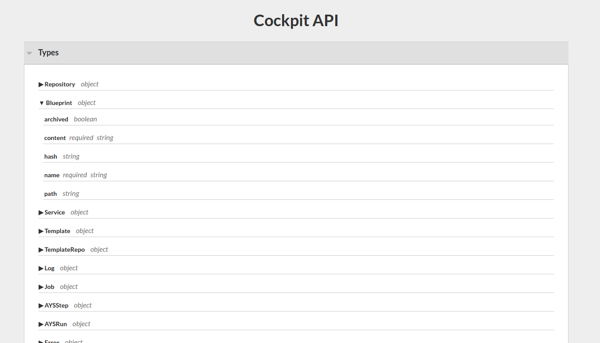
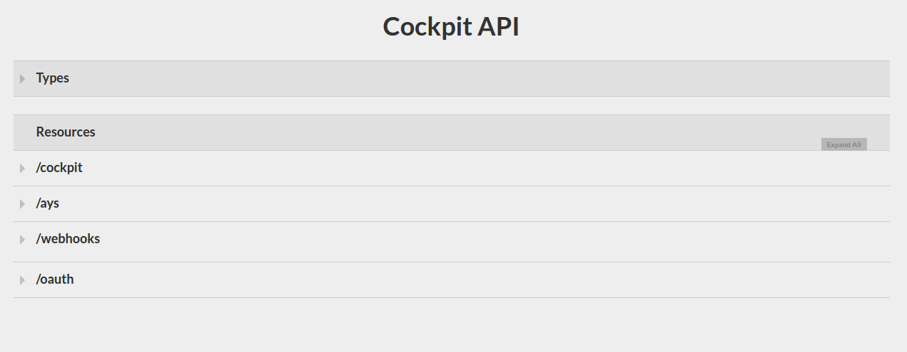
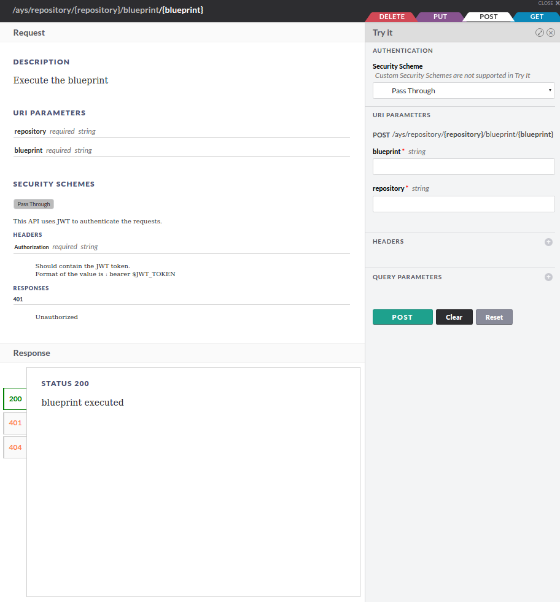
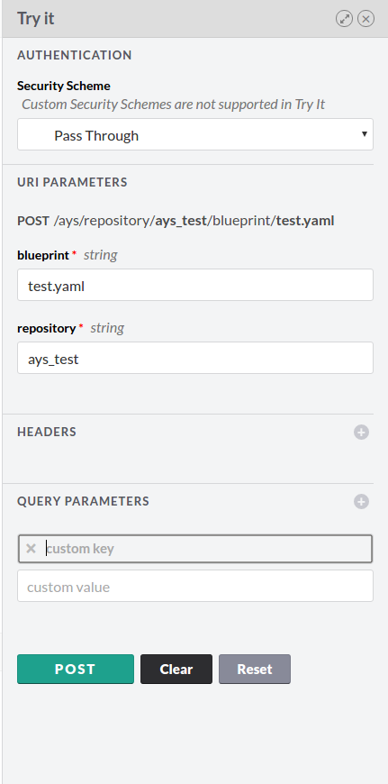

## API console

Select **AYS API** from the navigation menu under **AYS Portal**.

Clicking this link will open the **Cockpit API** page. The page lists all object types used in the API.

It is possible to expand each object type to list its parameters:

Under **Resources** we can see an overview of all API categories:
- **/cockpit** for updating the cockpit version
- **/ays** for running ays services using the API
- **/webhooks** for receiving events from github
- **/oauth** for receiving authorization code from oauth provider

The API console allows the user to try the API and send requests using different methods depending on the methods supported by each url.

By clicking on a request method, we can execute requests and get the response messages.

Requests are created by specifying the required URI parameters and the request headers and query parameters if required. This can be done on the right side of the screen:

