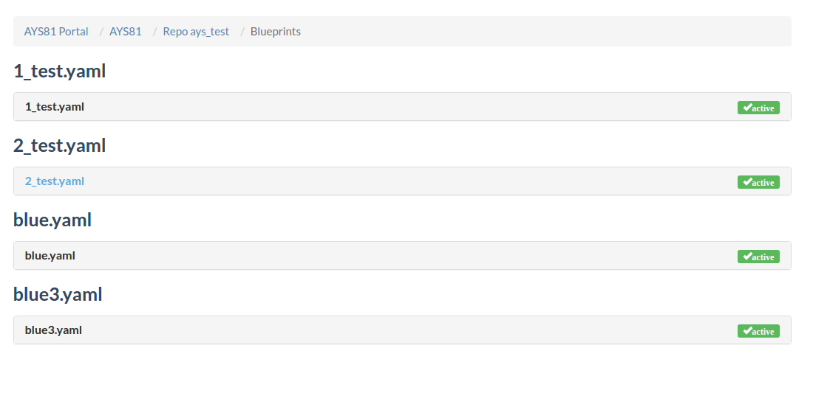
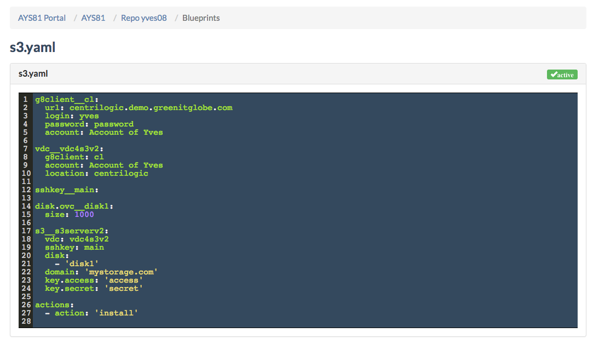

## Blueprints

The **Blueprints** page shows all blueprints for a selected AYS repository.

You get to a **Blueprint Details** page from any **Repository Details** page by clicking **Blueprints** in the navigation menu under **Links**:

The **Blueprint Details** page provides an overview of all blueprint files in the AYS repository:

By clicking on the name of a blueprint we can examine the content of the blueprint file.

In order to add a blueprint, see [How to create a blueprint](../usage/Howto/Create_blueprint/Create_blueprint.md).
