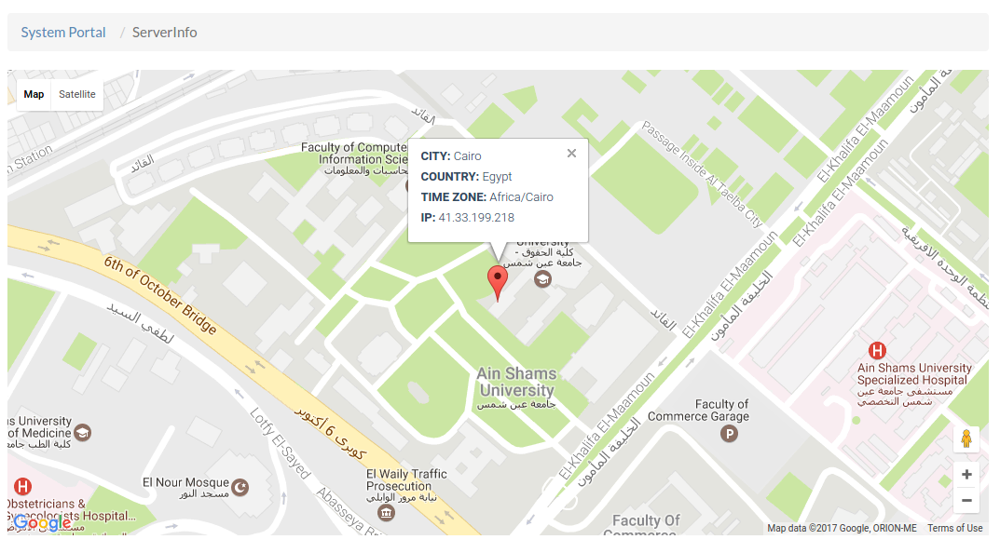

## Cockpit Connectivity Information

You can access this page by selecting **Server Info** from the navigation menu under **System Portal**.

The page displays the location of the server on the map, specifying the city, country and the time zone of the server. It also shows the IP address of the server running the cockpit.

