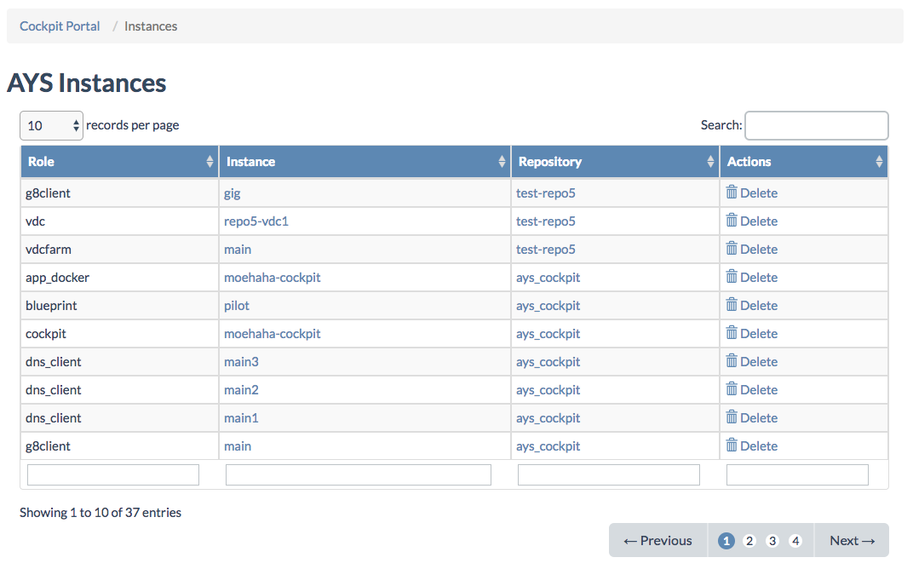
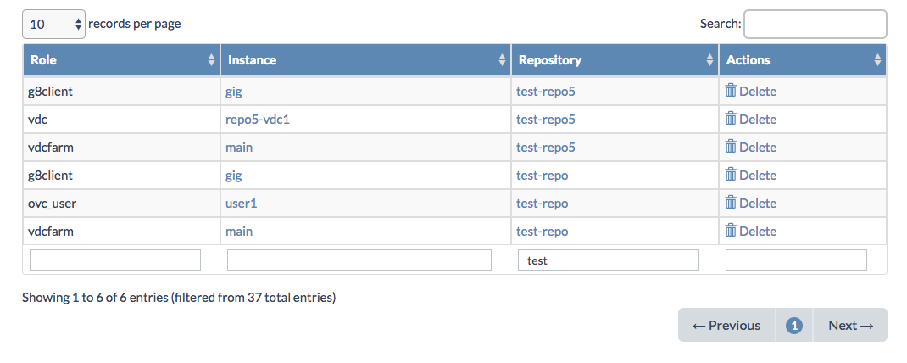
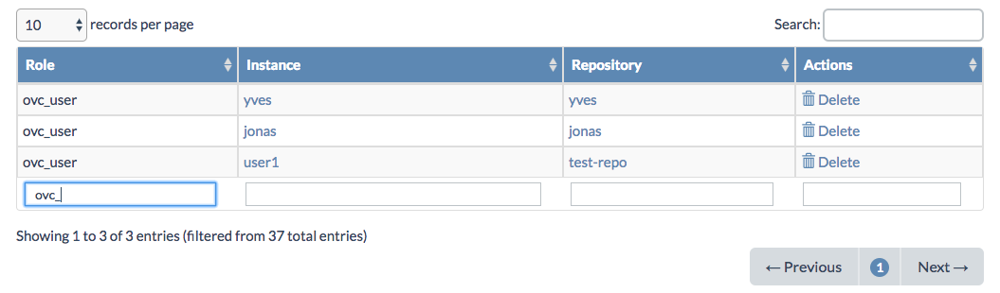
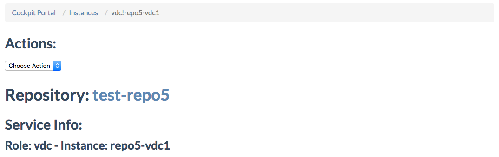
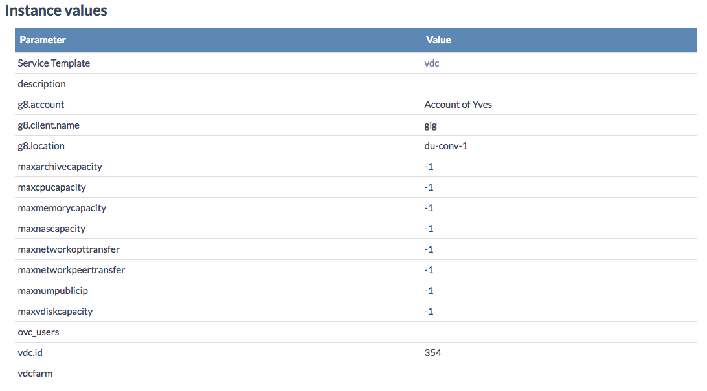
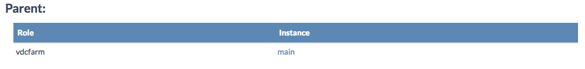
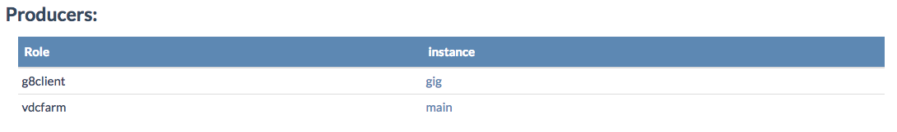
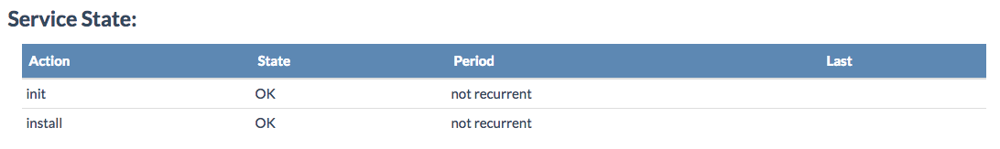

## Service Instances

The **Instances** pages shows all AYS service instances, of all repositories:

From here you can filter on the name of **repository**:

Or for instance filter on **role**:

From the service **instance** names in the table you can click through to the **Instance Details** page:

Via the **Actions** dropdown you can **Uninstall** or **Delete** the service instances.

Under **Instance values** all values set for the instance attributes are shown:

