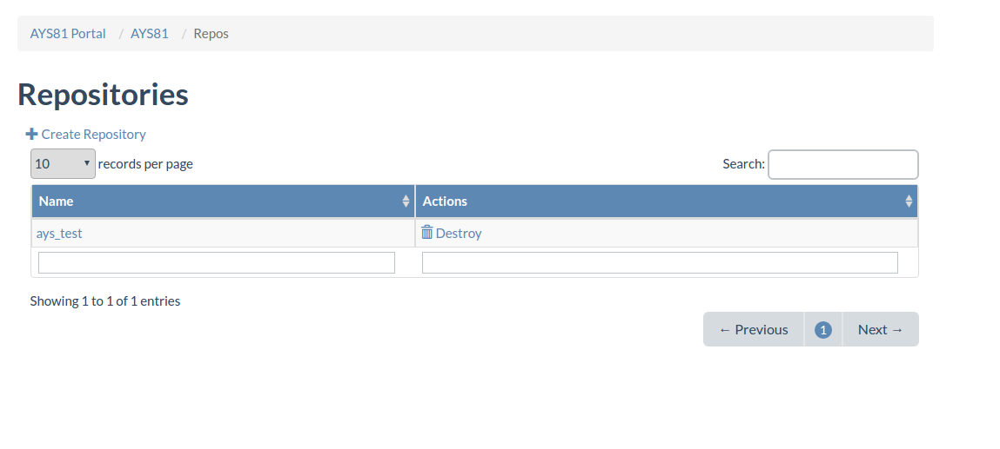
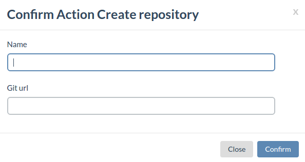
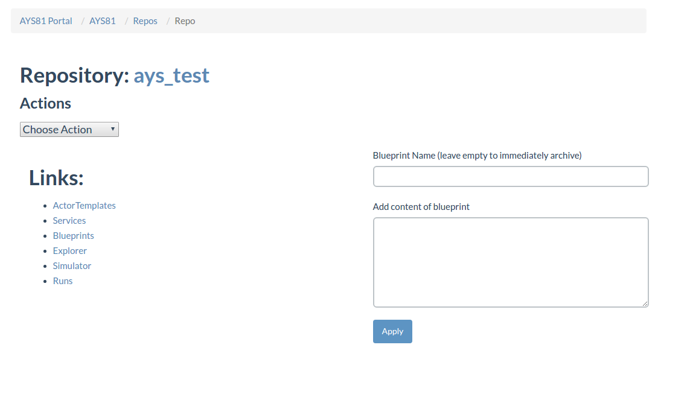
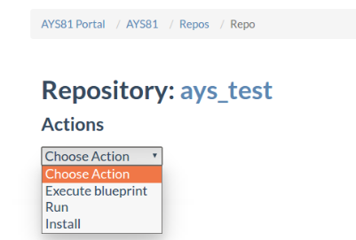
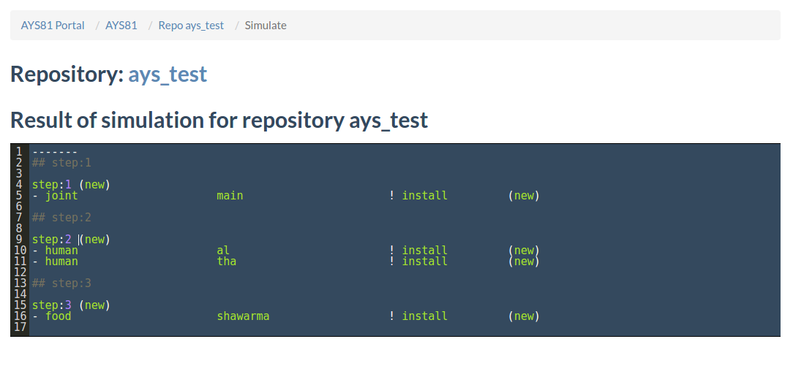

## Repositories

Select **Repositories** from the navigation menu under **AYS Portal**.

The page lists all the available AYS repositories, they can be searched by name and by actions. Deleting a repository is done by selecting the **Destroy** in the actions column.

 To create a new repository press **Create Repository** on top of the repositories listing.

 

Enter the name of the repository and the url of the Git repo that will be attached to it and confirm the creation of the repository.

Click the repo name to have an overview of its details and components.

To add a new blueprint enter the blueprint name at the right side of the screen and the blueprint content in the space under. Clicking apply will create a new blueprint for this repository.

You can perform several actions on an  AYS repository:

- **Execute blueprint** will create the services and schedule the actions specified in the blueprint files.
- **Run** execute the actions specified in the blueprint
- **Install** execute the `install()` function defined in the *actions.py*

In the **Links** menu the components of the AYS repository are listed:
- **ActorTemplates** contains all templates of this repository for more details see [here](/docs/walkthrough/Templates/Templates.md)
- **Services** All deployed instances of the templates for more information see [here](/docs/walkthrough/Services/Services.md)
- **Blueprints** contains the blueprints of the repo, see [here](/docs/walkthrough/Blueprints/Blueprints.md)
- **Explorer** simulates exploration of the repo as windows Explorer
- **Simulator** shows the steps that needs to be executed:

- **Runs** overview of all runs in the repository. For examples see [here](/docs/walkthrough/Runs/Runs.md)
