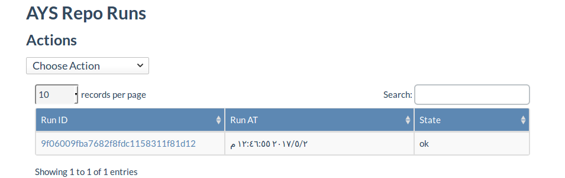
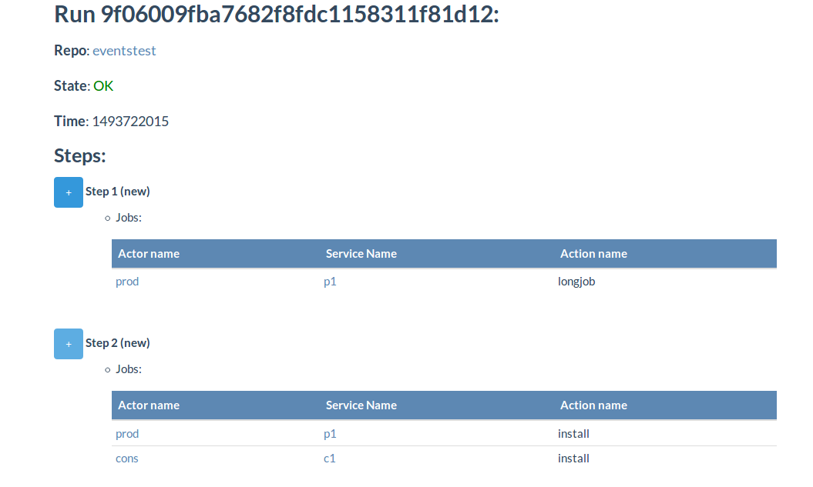

# Runs

## Listing all runs
a list of all runs exists under Repo runs option

## Run view
a run page shows the run `id`  and its state and the related steps

> Run is a list of dependent steps and a step is a list of jobs that can be executed in parallel
 

