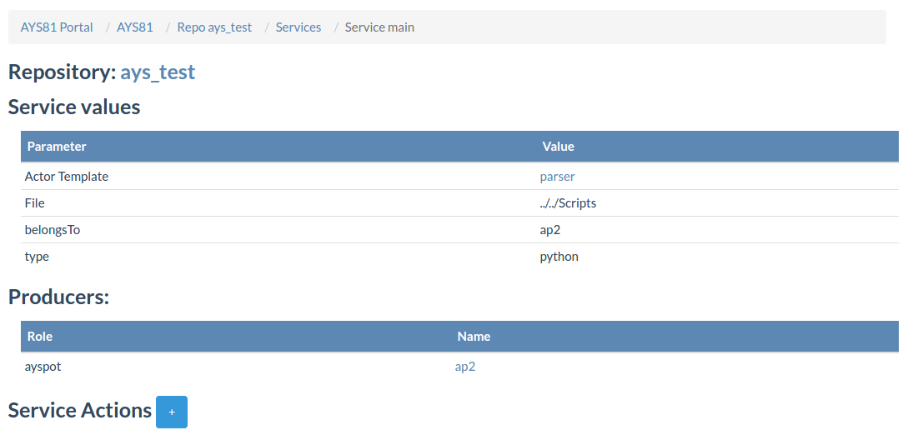
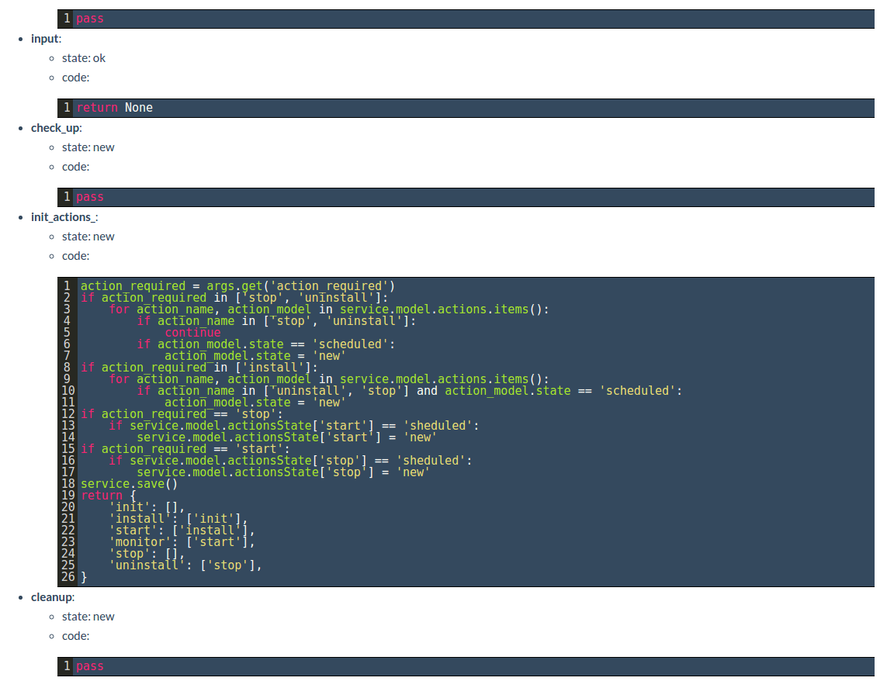

## Services

To view the services created in a repository, go to the repository page by selecting **Repositories** from the navigation menu and choosing the required repository. In the repository page select **Services** from the **Links** menu.

In this page all the services installed on this AYS repository are listed. The table has 4 columns:
- **Actor Name**: The actor template from which the service is deployed
- **Name**: Name of the service
- **state**: State of the service
- **Actions**: Actions to perform on the service

Clicking on a service name leads to **Service Details** page.

The page includes service information indicating the template name and the values of its parameters. The relationship between the service and other services is indicated beneath service information.
Viewing service actions can be done by expanding **Service Actions**:

For each action it is possible to view its state and code of the corresponding function is implemented.
