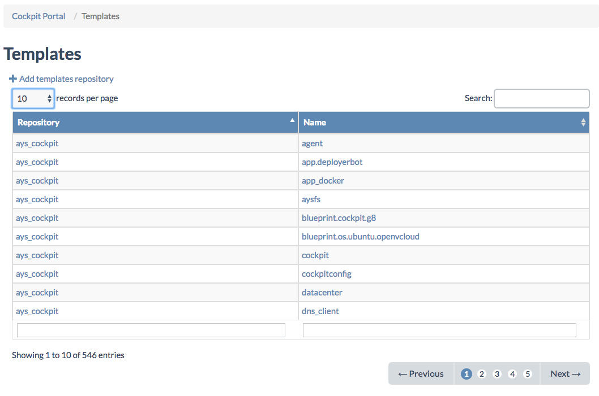
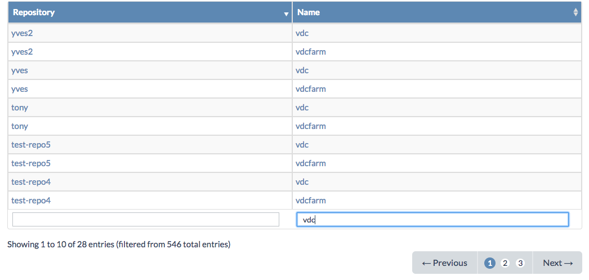
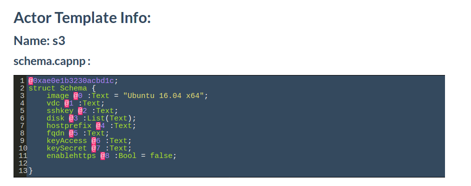
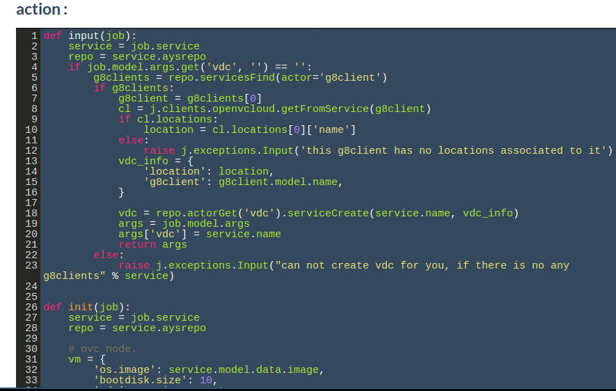
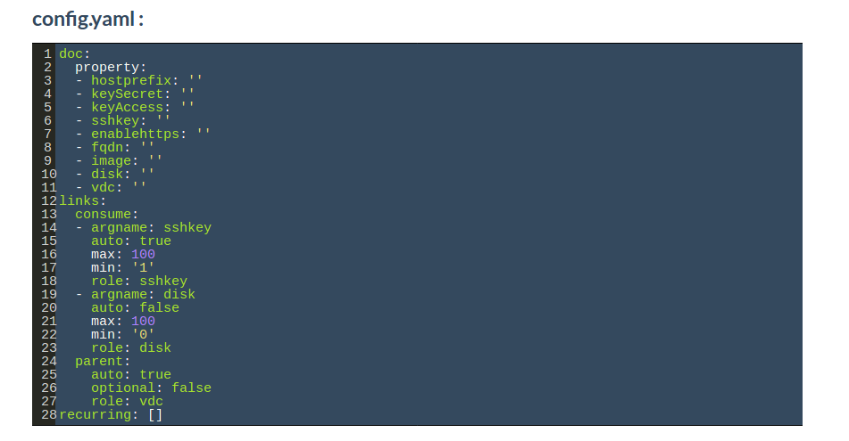

## Service Templates

In the **Templates** page you get an overview of all AYS service templates available in the Cockpit:

Here you can filter on the name of the **repository** where the template is available, or on the **name** of the service template:

Clicking the name of the service template leads you to the service **Template Details** page:

Under **schema.capnp** you see the attributes for describing a service instance of the service template type:

Under **actions.py** you see the implementation of all actions available for service instances of the service template type.

Here for the S3 service template for actions are implemented:

`config.yaml` describes the configurations of an actor (producers and parent relations and recurring jobs for instance)

    At the bottom of the page there is an overview of all service instances based on this service template:

  
