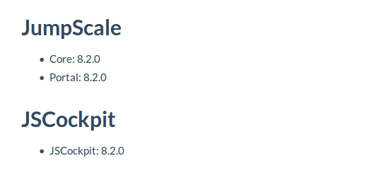

## Version

The **Version** page details the current version of the portal components.

It can be accessed by selecting **Version** from the navigation menu under **AYS Portal**.

The page specifies the versions of the JumpScale core installation and its portal as well as the version of the used JSCockpit.
