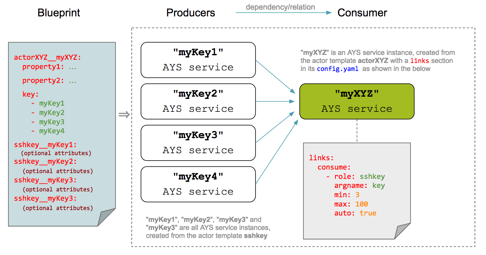
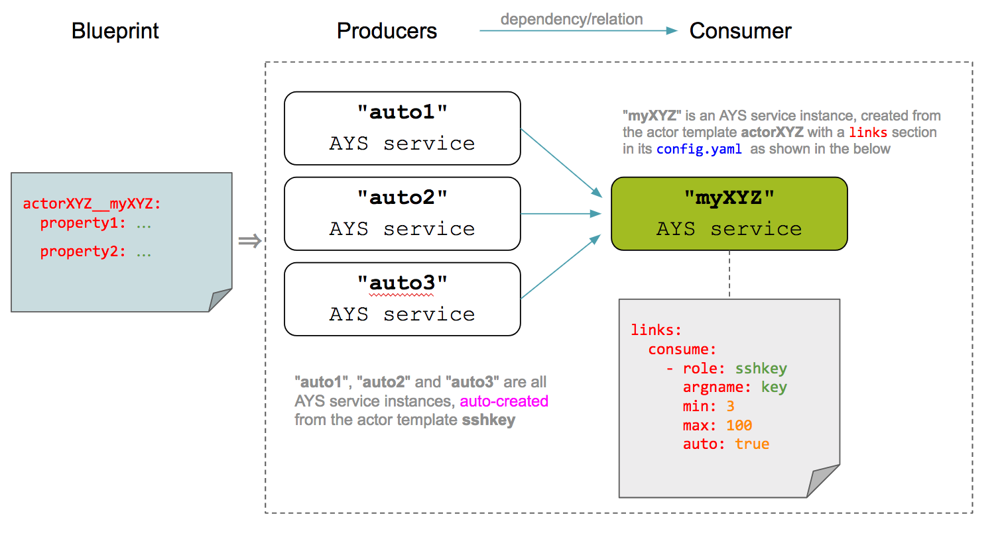
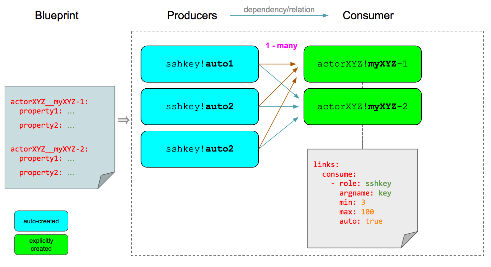
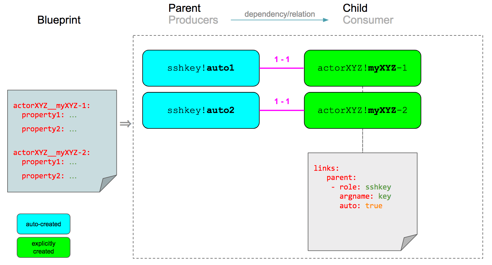
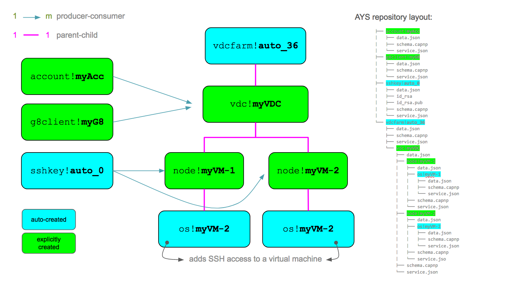
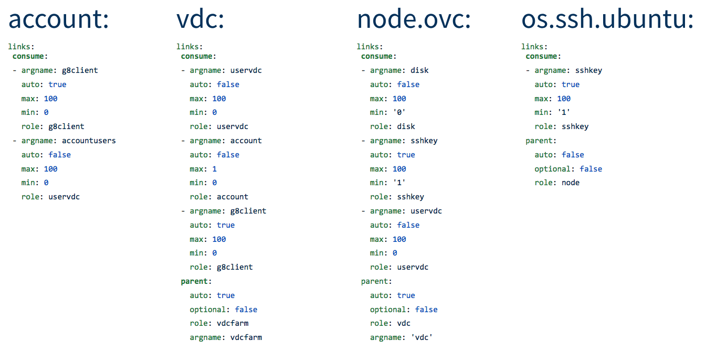

# Actor Configuration

In the (optional) `config.yaml` file of an [actor template](../Definitions/ActorTemplates.md) you configure:
- [Documentation](#documentation)
- [Relations](#relations)
- [Recurring actions](#recurring-actions)
- [Long running tasks](#long-running-tasks)
- [Timeouts](#timeouts)
- [Events](#events)


## Documentation

In the `doc` section of the `config.yaml` you can document the AYS service attributes.

Here's an example:
```yaml
doc:
  property:
  - sshkey: 'SSH key used to login'
```

## Relations

Relations is about the relations with - or dependencies to - other AYS services.

Two kind of relations can be defined:
- [Producer-Consumer](#producer-consumer) relations
- [Parent-Child](#parent-child) relations

Both types of relations are configured in the `links` section of `config.yaml`.

<a id="producer-consumer"></a>
### Producers & consumers

Each service can consume a service delivered by another "producing" AYS service. A producer is another AYS service delivering a service to one or more "consuming" AYS services.

It basically indicates that the AYS service is dependent on another AYS service, and that it can not be instantiated before the other `producing` AYS services has been instantiated.

AYS uses this to:
- Decide the order in which AYS services need to be instantiated
- Automaticly instantiate depending AYS services when not specified explicitly
- And most importantly, for self-healing purposes

The consumption of another service is specified in the `config.yaml` file of the actor template, using the `consume` keyword in the `links` section.

Here's an example:
```yaml
doc:
  property:
  - key: '...'

links:
  consume:
  - role: sshkey
    argname: key
    min: '3'
    max: 100
    auto: true
```

This describes that the AYS service consumes a minimum of `3` and a maximum of `100` `sshkey` AYS service instances, and that it should auto-create these instances if they don't already exist. The `min` and `max` tags are optional, they both default to `1`. The `auto` tag is a required tag, so you always need to specify a value (`true` or `false`) for it. Setting `max` to `0` means that there is no limit. Also `argname` is optional. It allows you to pass the name to the producing AYS service to an attribute that has a name that is different from the producing actor template name, as is the case in this example.

Here's an example of a blueprint for creating an AYS service that depends on at least three `sshkey` AYS service instances created, with the above `config.yaml`:



In this example blueprint four `sshkey` AYS service instances are explicitly defined. Alternativelly you can omit the explicit definitions of the `sshkey` AYS service instances, and let AYS auto-create them, and since the minimum was set to three instances, (only) three of them will be created. Also note that AYS will give them auto-generated names, in this case `auto1`, `auto2` and `auto3`.



In the next example the blueprint defines two instances of the consuming `actorXYZ` actor template. Since the producing `sshkey` AYS service instances are not defined explicitly, three of them will be auto-created, as you can see both `actorXYZ` AYS service instances will use the same three auto-created `sshkey` instances:




<a id="part-child"></a>
### Parents & Children

This is a special case of the [Producer-Consumer](producer-consumer) relation, where there can only be at most one parent for a child. The "consuming" child AYS service can only have one "producing" parent AYS service. So while the producer-consumer relation can be one-to-many, a parent-child is always one-to-one consumer-parent relation.

AYS uses this to:
- Prevent that a given "consuming" child AYS service has more than one "producing" parent
- Organize the AYS services hierarchically in the `services` direcory of the AYS repository, grouping all "consuming" children under their "producing" parent


Here's an example:
```yaml
doc:
  property:
  - node: '...'

links:
  parent:
    role: node
    argname: node
    auto: true
    optional: false
```

This describes that the service has a parent of role `node` and that AYS should auto-create its parent if it doesn't already exist.

Further more:
- `auto` instructs AYS to look for an already existing parent of the specified type, and if yes to use that one
- `optional` tag informs AYS that the parent relationship is not required

Both the `optional` and `auto` tags are optional. When not specified they will default to `false`.

Taking again the example from above, here each `actorXYZ` AYS service instance have a one-to-one relationship with an `sshkey` AYS service instance, which gets auto-created because of the `auto: true` in the definition:



To clarify how AYS hierarchically organizes AYS services that have a parent-child relationship consider the following additional example.

Considering this blueprint:
```yaml
datacenter__eu:
    location: 'Europe'
    description: 'Main datacenter in Europe'

datacenter__us:
    location: 'USA'
    description: 'Main datacenter in USA'


rack__storage1:
    datacenter: 'eu'
    location: 'room1'
    description: 'rack for storage node'

rack__storage2:
    datacenter: 'eu'
    location: 'room1'
    description: 'rack for storage node'

rack__cpu1:
    datacenter: 'us'
    location: 'east building'
    description: 'rack for cpu node'

rack__storage4:
    datacenter: 'us'
    location: 'west buuilding'
```

In this example the `rack` AYS service uses the datacenter AYS service as parent.

AYS will create the following tree in the AYS repository when instantiating the AYS services:
```shell
$ tree services/
services/
├── datacenter!eu
│   ├── data.json
│   ├── schema.capnp
│   ├── rack!storage1
│   │   ├── data.json
│   |   ├── schema.capnp
│   │   └── service.json
│   ├── rack!storage2
│   │   ├── data.json
│   |   ├── schema.capnp
│   │   └── service.json
│   └── service.json
└── datacenter!us
    ├── data.json
    ├── schema.capnp
    ├── rack!cpu1
    │   ├── data.json
    |   ├── schema.capnp
    │   └── service.json
    ├── rack!storage4
    │   ├── data.json
    |   ├── schema.capnp
    │   └── service.json
    └── service.json
```

And finally, here is an OpenvCloud example:



Here the relations are defined as follows:



You can check the actual actual templates files for the above OpenvCloud example here:
- [sshkey](https://github.com/Jumpscale/ays9/tree/master/templates/clients/sshkey)
- [g8client](https://github.com/Jumpscale/ays9/tree/master/templates/clients/g8client)
- [account](https://github.com/Jumpscale/ays9/tree/master/templates/ovc/account)
- [vdcfarm](https://github.com/Jumpscale/ays9/tree/master/templates/ovc/vdcfarm)
- [vdc](https://github.com/Jumpscale/ays9/tree/master/templates/ovc/vdc)
- [node.ovc](https://github.com/Jumpscale/ays9/tree/master/templates/nodes/node.ovc)
- [os.ssh.ubuntu](https://github.com/Jumpscale/ays9/tree/master/templates/os/os.ssh.ubuntu)


## Recurring actions

Recurring actions are actions that are periodically executed asynchronously, not using [runs](../Definitions/Runs.md).

Recurring actions are configured in the `recurring` section of the `config.yaml` file.

Here's an example:
```yaml
recurring:
    -   action: monitor
        period: 30s
        log: True

    -   action: dosomethingelse
        period: 1m
        log: True
```

This configuration will result in AYS service with the `monitor()` action that is scheduled to be executed every 30 seconds, and a `dosomethingelse()` action scheduled for execution every minute.

You can use monitor actions to self heal any failed actions by using `self_heal_action` method.
`self_heal_action` will search if the action has a job already scheduled before, in this way it will avoid scheduling the same action job more than one time if failed.
if there were not any scheduled job for the action, It will create a run and schedule it with repo run scheduler.
The run will contain jobs for the failed `action` and all its `dependency chain`, tagged by `self_heal_internal` tag
to be able to search by this tag afterwards.
```python
def monitor(job):
    # Check here for failed action ....
    # ....
    # ....
    service = job.service
    service.self_heal_action('<ACTION_NAME>')
``` 
## Long running tasks

AYS is using [asyncio](https://docs.python.org/3/library/asyncio.html) for implementing concurrency.

The above discussed [recurring actions](#RecurringActions) will serve you well to a limit as it uses `loop.run_in_executor`, which means it will be mapped to a thread which requires a lot of resources compared to a [coroutine](https://docs.python.org/3/library/asyncio-task.html).

For long running actions it is recommended to rather tag the action as a long running task, which is a coroutine to be executed in the AYS main loop, helping you to overcome the limits of `recurring tasks`.

Tagging an action as a long running task is achieved by including them in the `longjobs` section of the `config.yaml` file, as follows:
```
longjobs:
    - action: long2
```

This is for the `long2(job)` example action as implementaed in the following `actions.py`:
```python
def long2(job):
    # check if key "shouldstop" is set in redis
    async def inner(job):
        import aioredis
        from asyncio import sleep, get_event_loop
        loop = get_event_loop()
        redis = await aioredis.create_redis(('localhost', 6379), loop=loop)
        while True:
            job.logger.info("Checking for shouldstop key: ")
            val = await redis.get('shouldstop')
            if val == b"1":
                job.logger.info("Should stop executing now.")
                redis.close()
                await redis.wait_closed()
                break
            await sleep(1)
        job.logger.info("Completed execution of long job long2")
    return inner(job)
```

> Note: code in inner(job) needs to be fully async or the code will block AYS main loop.

## Timeouts

Actions can either have the defaut timeout (3000 seconds) or have their own timeout configured.

This timeout is configured at actor template level and is applied on all its service instances.

Timeouts are configured in the `timeouts` section of the `config.yaml` file.

Here's an example:
```yaml
timeouts:
    - action1: 10s
    - action2: 5m
```

## Events

An action can be registered as an event handler for an AYS event.

This is done using an `events` section in the `config.yaml` of the template.

Here's an example:
```yaml
events:
    -   channel: telegram
        command: install_mynode
        actions:
            - install
            - actionX
        log: True
        role: node.ssh
        service: mynode
        tags: color:red
        secrets:
            - 1234
    -   command: stop
        actions: stop,kill
        log: False
        secrets:  1234
    -   command: issue_delete
        role: issue
        instance: myissue
```

See [Events](../Definitions/Events/README.md) for an example of a "consuming" AYS service that handles the events triggered by another "producing" AYS service. The example as shows how to register an event handler using code, instead of doing it declaratively in the ` events` section.
