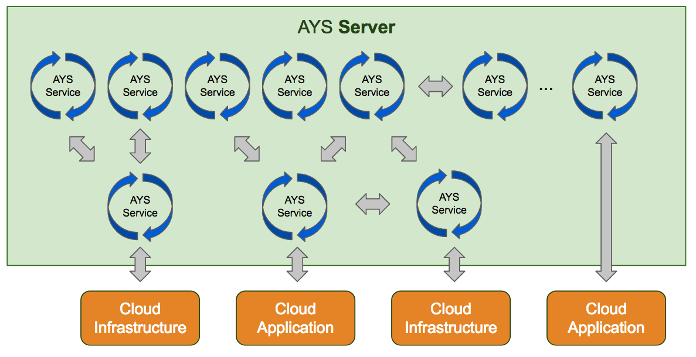
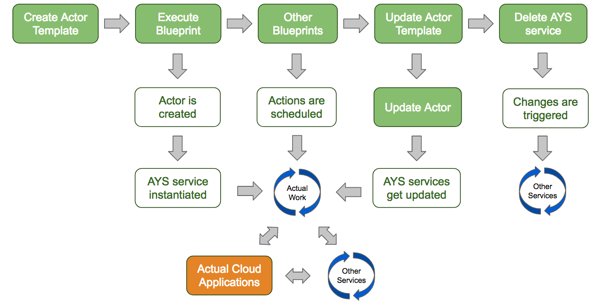
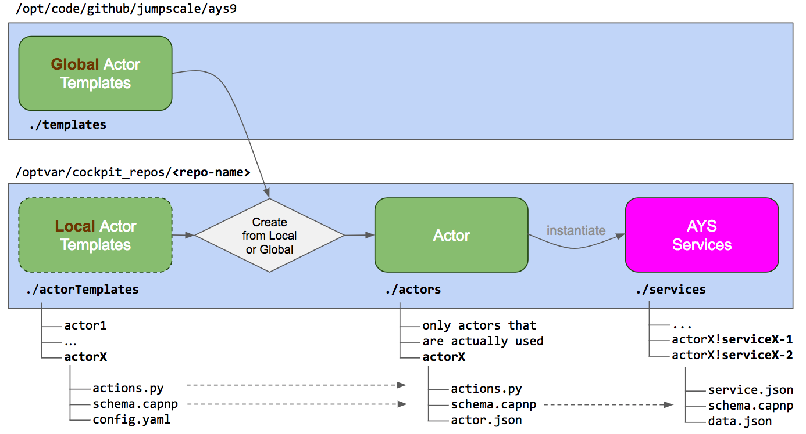

# AYS Services

AYS is an application lifecycle management system for cloud applications.

Each application or application component managed by AYS is represented by an AYS service.

So an AYS service can be seen as an AYS server-hosted "proxy" for a cloud application or any of its components.

An AYS service "lives" in an AYS server:



It has the following application lifecycle management functions:
- **Install** the actual application and all its components
- **Start, restart and stop** the application or any of its components
- **Monitor** the application and all its components, and take appropriate actions when needed
- Perform **backup and restore** operations, **self-healing** and **auto-scaling** operations
- **Uninstall** the application and all its components
- Other **application-specific** management functions

AYS services are instantiated by executing AYS blueprints, discussed in [Blueprints](Blueprints.md).

AYS services are actually instances of [actors](Actors.md), which in turn are instances of [actor templates](ActorTemplates.md).

So instantiating an AYS service is actually a two-step process:
- First AYS checks whether the actor is already available in the `actors` directory of the AYS repository, and if not found AYS will create the actor by copying the actor template into the `actors` directory
- And then based on the actor the AYS service is instantiated

The full process is explained below in the [lifecycle of an AYS service](#lifecycle) overview.


<a id="lifecycle"></a>
## Lifecycle of an AYS Service

The lifecycle of any application can be managed by AYS.

For each application or application component managed by AYS you need an AYS service.

The lifecycle of an AYS service itself is as follows:

- [Creation of an actor template](#create-template)
- [Execution of a blueprint](#execute-blueprint)
- [Creation of an actor](#create-actor)
- [Creation of the AYS service](#create-service)
- [Scheduling of AYS service actions](#schedule-actions)
- [Updating the AYS service](#update-service)
- [Deleting the AYS service](#delete-service)




<a id="create-template"></a>
### Creation of an actor template

In order to instantiate an AYS service you first need an actor template.

For more details about actor templates, see [Actor Templates](ActorTemplates.md).


<a id="execute-blueprint"></a>
### Execution of a blueprint

The instantiation of a new AYS service is started by executing a blueprint.

The blueprint includes the following information:
- Actor template from which the AYS service needs to be instantiated
- Attributes of the new AYS service, based on the actor template schema
- Actor templates and attributes of all other AYS services the new AYS service depends on

See [Blueprints](Blueprints.md) for more details.


<a id="create-actor"></a>
### Creation of an actor

An actor is a copy of an actor template, residing in the `actors` subdirectory of the AYS repository.



This is how the copy process works:
- First AYS looks in the subdirectory `actorTemplates` for a local version of the actor template, and if not found checks wether there is global actor template with the name as specifed in the blueprint
- Once the actor template is found, AYS copies the files `actions.py` and `schema.capnp` from the local or global actor template directory into a new subdirectory under `actors`; this subdirectory gets the same name of the actor template

All AYS services instantiated from the specified AYS actor templates will use the copied actor instances available from the `actors` subdirectory.

This mechanism allows to have different versions of an actor template per repository.

Apart from the AYS services as explicitly defined in the blueprint, AYS will typically also instantiate other AYS services on which the explicitly defined AYS services depend. See the section [Producers & Children](Producers-Consumers) for more details.


<a id="create-service"></a>
### Creation of the AYS service

What actually happens when the blueprint defining the AYS service is executed is that the data for each of the service instances gets created in the `services/.../$servicerole!$serviceinstance/` subdirectory of the AYS repository.

The `data.json` has all the configuration settings for that AYS service instance.


<a id="schedule-actions"></a>
### Scheduling of AYS service actions

Once an AYS service is initiated it is ready to do actual work, managing the full lifecycle of the application it represents.

A typical first job is installing and starting this application.

Jobs are actually scheduled executions of the actions. Executions are scheduled with blueprints that include action sections in the followinf format:

```yaml
actions:
  - action: <name-of-action>
    actor: <actor-name>
    service: <ays-service-name>
```

See [Actions](Actions.md) for more details.


<a id="update-service"></a>
### Updating the AYS service

In order to update an AYS service to a newer version you start by updating its AYS actor template.

This is done by eigther updating the **global** actor templates or the **local** actor templates:
- Updating the **global** actor templates is usually achieved by performing a `git pull` in the AYS9 system repository (`/opt/code/github/jumpscale/ays9`)
- Updating the **local** actor templates is usually achieved by performing a `git pull` in the the local repository (`/optvar/cockpit_repos/<name-of-your-ays-repository>`)

> Note that the above updates **all** global or local actor templates.

Once the actor template is updated, you need to update the actor, which is achieved by executing the `ays actor update` command. Here you can be more specific by specifying the actor name with the `- n` option.

In case the updated actor template not just updates the `actions.py`, but also the schema you'll also need to update the blueprint to reflect the schema changes, and to execute the `ays blueprint` command. This will update to the `data.json` files of the affected AYS services accordingly.

<a id="delete-service"></a>
### Deleting the AYS service

AYS services cannot be deleted if itself or any of its children break the minimum requirements of any of their consumers upon deletion.

#### producer_removed

When an AYS service is deleted its consumers are notified through their `processChange(job)` action.

In case of producer removal a change in the `links` category would be propagated to its consumers

```
def processChange(job):
    args = job.model.args
    category = args.pop('changeCategory')
    if category=="links":
        producers=args.pop("producer_removed", None)
        print("producer was removed ", producers)
```

> service.delete triggers processChange with `links` changeCategory and producer_removed key containing the removed producer `role!name`


#### Default implementation for delete action

If no `Delete(job)` action has been implemented `j.tools.async.wrappers.sync(job.service.delete())` will be used.
