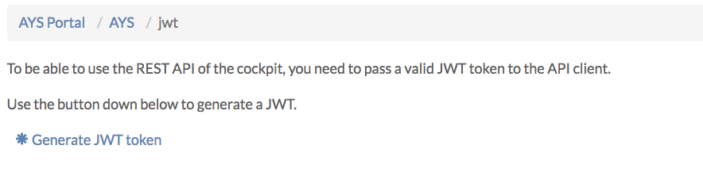
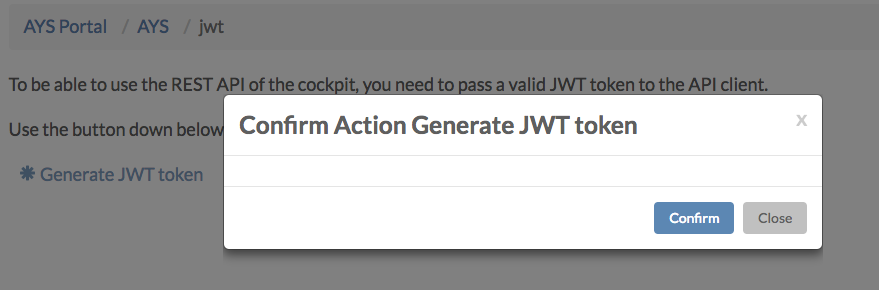
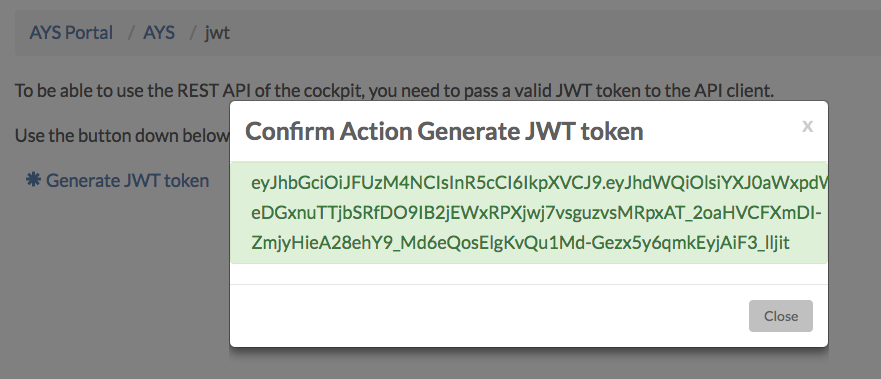

# How to Get a JWT

You will need to create an API key in ItsYou.online for a user that has access to the targeted environment.

There are three options:
- [Using the AYS Portal](#using-the-ays-portal)
- [Using the AYS command line tool](#using-the-ays-command-line-tool)
- [Using the AYS RESTful API](#using-the-ays-restful-api)


## Using the AYS Portal








## Using the AYS command line tool

```bash
ays generatetoken --clientid '<client-id>' --clientsecret' <client-secret>' --organization 'organization'
```


## Using the AYS RESTful API

```bash
CLIENTID="..."
SECRET="..."
curl -o JWT -d 'grant_type=client_credentials&client_id='"$CLIENTID"'&client_secret='"$SECRET"'&response_type=id_token' https://itsyou.online/v1/oauth/access_token
```

Or in order to copy the JWT into an environment variable:
```bash
JWT=$(curl -d 'grant_type=client_credentials&client_id='"$CLIENTID"'&client_secret='"$SECRET"'&response_type=id_token' https://itsyou.online/v1/oauth/access_token)
```

> Excluding `&response_type=id_token` will only yield an access token, not a JWT.
