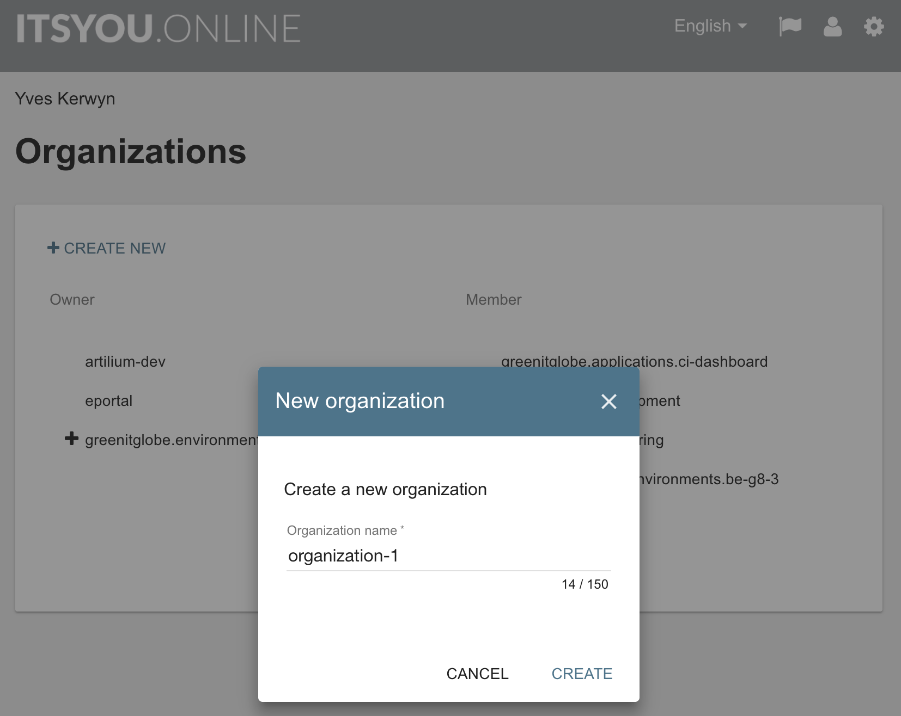
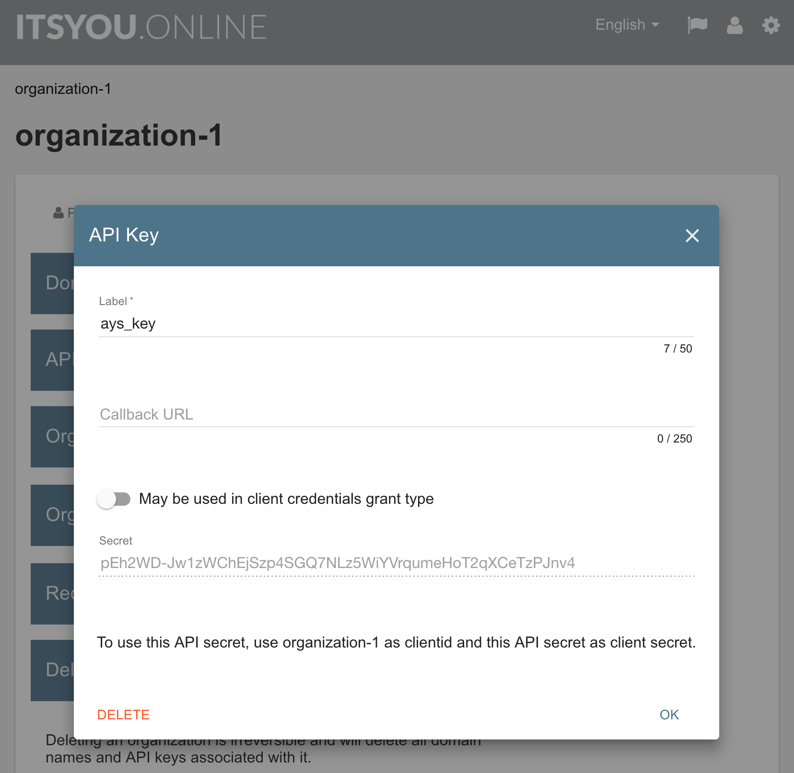

# Start AYS

You will first want to review the configuation of your AYS server, as documented in [AYS Server Configuration](ays-server-configuration.md).

Most importantly, in order to run AYS in **production mode** you need to update or add following two sections in `/optvar/cfg/jumpscale9.toml`:
```toml
[ays]
production = true

[ays.oauth]
jwt_key = "MHYwEAYHKoZIzj0CAQYFK4EEACIDYgAES5X8XrfKdx9gYayFITc89wad4usrk0n27MjiGYvqalizeSWTHEpnd7oea9IQ8T5oJjMVH5cc0H5tFSKilFFeh//wngxIyny66+Vq5t5B0V0Ehy01+2ceEon2Y0XDkIKv"
organization = "organization-1"
```

Running AYS in production mode means that the ItsYou.online integration will be activated. Once activated all interactions with AYS will require authentication against ItsYou.online. Using the RESTful API of AYS will then require a JWT in the HTTP header of all interactions. AYS will then use the public key of ItsYou.online as passed as a value for the configuration key `jwt_key` to verify the validity of the JWT, and check whether it was generated for the ItsYou.online organization as specified with the value (here `organization-1`) for the configuration key `organization`.

> Note: the public key of ItsYou.online can be found and copied from the [JWT support documentation of ItsYou.online](https://gig.gitbooks.io/itsyouonline/content/oauth2/jwt.html))

The value for the configuration key `organization` needs to match with the name of an ItsYou.online organization name. If not yet created one, login to [ItsYou.online](http://ItsYou.online) and create a new organization:



With the below command we make AYS listen on port 5000 on all interfaces:
```shell
ays start -b 0.0.0.0 -p 5000
```

As a result a new TMUX session will start, to which you might want to attach:
```shell
tmux at
```

In order to check that everything is working well do the following:
- [Create an ItsYou.online API key](#configure-iyo)
- [Generate a valid JWT](#generate-jwt)
- [Create an AYS repository](#create-repo)

<a id="configure-iyo"></a>
## Configure ItsYou.online

You need to create an API key in order to generate a valid JWT.

Login to [ItsYou.online](http://ItsYou.online), click **+ ADD** on the **Settings** tab of your organization, and label the API with any label:


Click **Create**, copy the generated secret value for later use, and then close the dialog.




<a id="generate-jwt"></a>
## Generate a valid JWT

With the generated secret value, you can now generate a JWT using the AYS command line tool:
```shell
ays generatetoken --clientid "organization-1" --clientsecret "generated-secret-value"
```
> In case of error downgrade to version 1.3.2 of `python-jose`:
> `pip uninstall python-jose`
> `pip install== 1.3.2`

Copy the output of the previous command and execute it.

<a id="create-repo"></a>
## Create an AYS repository

As a first test use the AYS command line tool to create an AYS Repository:
```shell
ays repo create -n "repo1" -g http://your-first-ays-repo
```

This will create your AYS repository in a subdirectory (`repo1`) of `/optvar/cockpit_repos`.


Next you will probably want to join you container into your ZeroTier network, as documented in [Join Your ZeroTier Network](zt.md).
